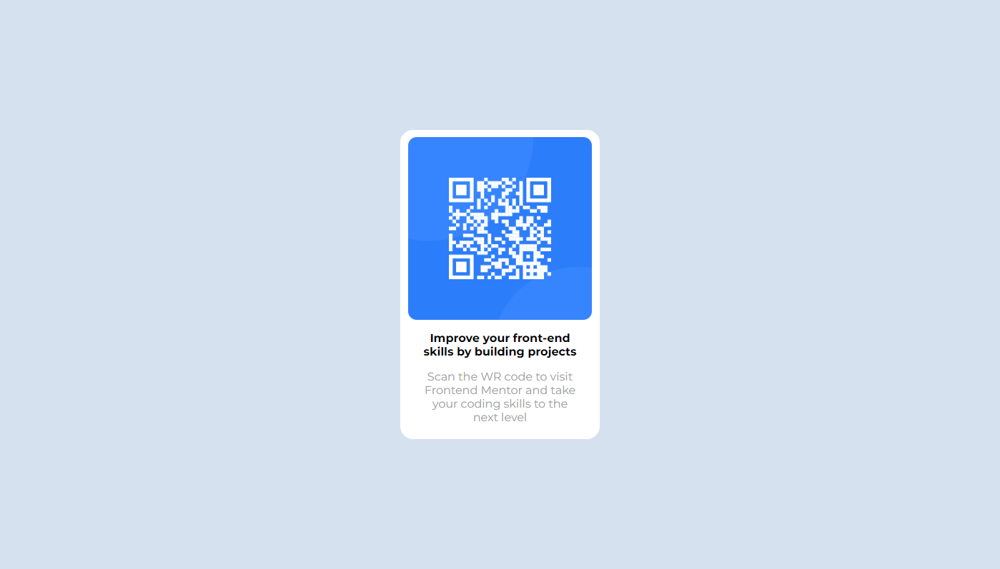
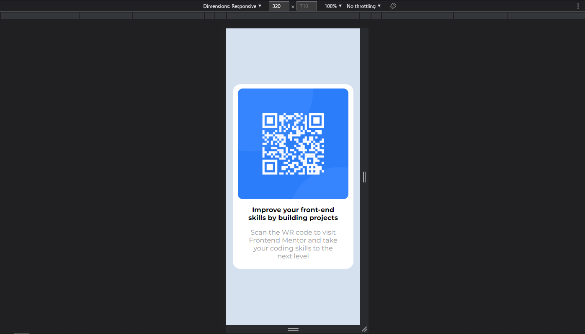

# Frontend Mentor - QR code component solution

This is a solution to the [QR code component challenge on Frontend Mentor](https://www.frontendmentor.io/challenges/qr-code-component-iux_sIO_H). Frontend Mentor challenges help you improve your coding skills by building realistic projects.

## Table of contents

- [Overview](#overview)
  - [Screenshots](#screenshots)
- [My process](#my-process)
  - [Built with](#built-with)
- [Author](#author)
- [Tips](#tips)

## Overview

I succcessfully built the Frontend Mentor QR Code challenge, where I should build a QR Code card and it must be responsive.

### Screenshots

Here you can see an overview of how it behaves in desktop displays

And here how it behaves in mobile displays

## My process

### Built with

- HTML
- CSS
- CSS custom properties
- Flexbox

## Author

- Website - [Personal Portfolio](beatrizneaime.vercel.app)
- Frontend Mentor - [@BeatrizNeaime](https://www.frontendmentor.io/profile/BeatrizNeaime)
- Linkedin Profile: [Beatriz Neaime](https://www.linkedin.com/in/beatriz-neaime-1564b51b1/)

## Tips

- Flexbox
- CSS custom properties
